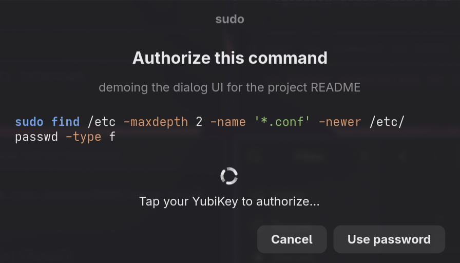
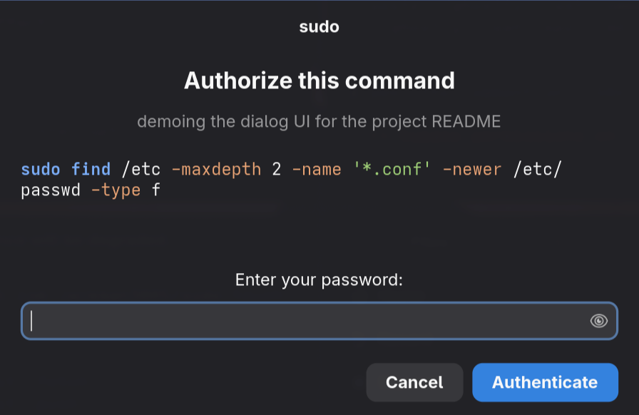

# sudo-touch-dialog

A GTK4/Adwaita confirmation dialog for `sudo` that supports YubiKey
tap, password fallback, and explicit reject. Built for non-interactive
shells (Claude Code, automation, scripts) where you want every
elevated command explicitly authorized — but where authentication
itself should be a hardware tap when possible.

## Screenshots

<table>
<tr>
<td align="center" width="50%">
  
  <br><sub><b>YubiKey mode</b> — tap your key to authorize, or fall back to a password.</sub>
</td>
<td align="center" width="50%">
  
  <br><sub><b>Password mode</b> — used when no FIDO key is plugged in.</sub>
</td>
</tr>
</table>

## What it does

A small floating window appears whenever something tries to `sudo`. It:

- Displays the literal command being run, with shell-syntax-highlighted
  Pango markup (`sudo` and the command name in blue, flags in orange,
  quoted strings in green). Long commands wrap at word boundaries.
- Optionally shows a one-line **reason** — set
  `CLAUDE_SUDO_REASON="why this is happening"` in the env and it
  appears as a subtitle. (Designed for LLM-driven shells; any caller
  can use the var.)
- Adapts to three states automatically:
  - **cached** — sudo timestamp fresh: just *Approve* / *Cancel*.
  - **touch** — YubiKey present: tap your key, or click *Use password*.
  - **password** — no YubiKey: type and submit.
- Hides itself once sudo hands off to the wrapped command, so
  long-running operations (`pacman -S …`, builds, etc.) don't leave a
  modal dim across your desktop. The dialog process keeps running in
  the background to forward sudo's exit code.
- Logs every invocation to `~/.local/state/sudo-askpass/asksudo.log`
  as APPROVED / REJECTED / FAILED.

## Files

```
bin/sudo-askpass            bash wrapper, flock-serializes invocations
bin/sudo-touch-dialog       Python+GTK4 dialog, runs sudo internally
bin/sudo-askpass-bridge     `cat $FIFO` — sudo's askpass for password fallback
config/hyprland-windowrules.conf   float/center/pin/stay_focused/dim_around
docs/                       architecture, gotchas, integration notes
install.sh                  symlinks bin/* into ~/.local/bin/
```

## Tested on

- **Distro**: Arch Linux (specifically Omarchy)
- **Compositor**: Hyprland (Wayland)
- **Sudo**: 1.9.x with `pam_u2f` configured as the first `sufficient`
  auth method
- **YubiKey**: 5-series (FIDO2)

The dialog itself is portable GTK4 + Python — should run on any
Wayland or X11 desktop with `python-gobject`, `gtk4`, and
`libadwaita`. The window-management bits (centering, pin, dim_around)
are Hyprland-specific; for GNOME / KDE / Sway you'll need to
substitute equivalent rules.

## Install

```sh
git clone https://github.com/Jackman3005/sudo-touch-dialog.git
cd sudo-touch-dialog
./install.sh
```

`install.sh` symlinks `bin/*` into `~/.local/bin/` so the repo is the
source of truth — pull and the symlinks pick up new versions.

Then, manually:

1. **Hyprland**: source the windowrules from your `hyprland.conf`:
   ```
   source = /absolute/path/to/sudo-touch-dialog/config/hyprland-windowrules.conf
   ```
   `hyprctl reload` to apply.
2. **Non-interactive sudo shim**: in `~/.bashrc`, before any
   `[[ $- != *i* ]] && return`:
   ```bash
   if [[ $- != *i* ]]; then
       sudo() { "$HOME/.local/bin/sudo-askpass" "$@"; }
       return
   fi
   ```
   See `docs/claude-integration.md` for why and the snapshot caveat.

## Prerequisites

- `pam-u2f` set as a sufficient auth method in `/etc/pam.d/sudo`:
  ```
  auth sufficient pam_u2f.so cue authfile=/etc/fido2/fido2
  ```
- A FIDO2 credential registered for your user
  (`pamu2fcfg -o pam://… -i pam://… > /etc/fido2/fido2`).
- Packages: `python-gobject`, `gtk4`, `libadwaita`, `inotify-tools`.

`lxqt-openssh-askpass` is **not** required — this dialog replaces it
for sudo. (Other consumers of `SUDO_ASKPASS` are unaffected.)

## Exit codes

- `0` — sudo ran (forwards command's exit code).
- `77` — user clicked **Cancel** (logged REJECTED, stderr `sudo:
  command rejected by user`).
- other non-zero — sudo failure or the command itself failed.

## Why not just use the stock askpass?

`lxqt-openssh-askpass` (and `ssh-askpass`, etc.) are generic
single-line password dialogs — they have no hooks for showing the
command, no "Tap YubiKey" indicator, no reject button distinct from
"wrong password", and they can't tell the user what the elevation is
*for*. Under `sudo -A`, pam_u2f's "Please touch the FIDO
authenticator." cue is written to stdout (via `SUDO_CONV_INFO_MSG`)
where a GUI session can't see it; after 30 s of nothing visibly
happening, askpass finally pops up asking for a password — when a
quick tap would have authorized it. This dialog replaces that with a
single coordinated UI.

## Docs

- [`docs/architecture.md`](docs/architecture.md) — how the pieces fit
- [`docs/gotchas.md`](docs/gotchas.md) — non-obvious things (no-tty
  timestamp, SIGTERM-vs-SIGKILL, snapshot-cached bash function, …)
- [`docs/claude-integration.md`](docs/claude-integration.md) — bashrc
  shim, `CLAUDE_SUDO_REASON`, suggested CLAUDE.md rule

## License

MIT — see [LICENSE](LICENSE).
